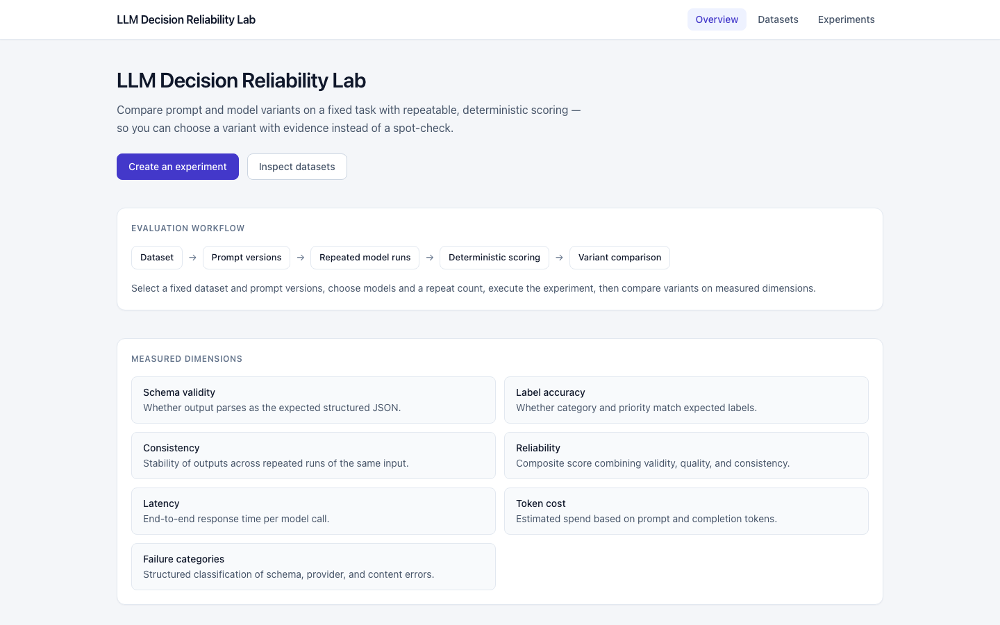
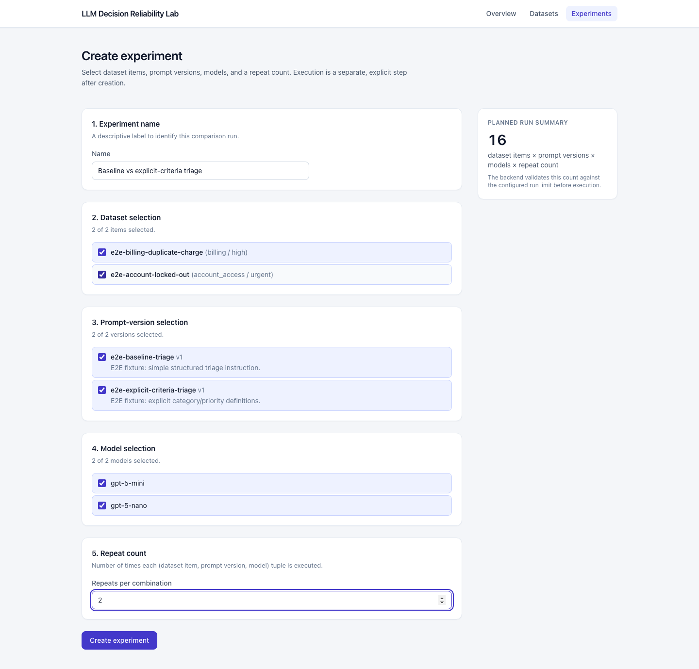
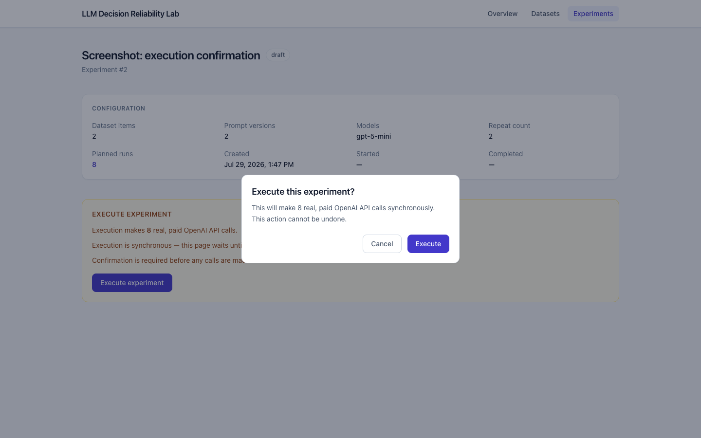
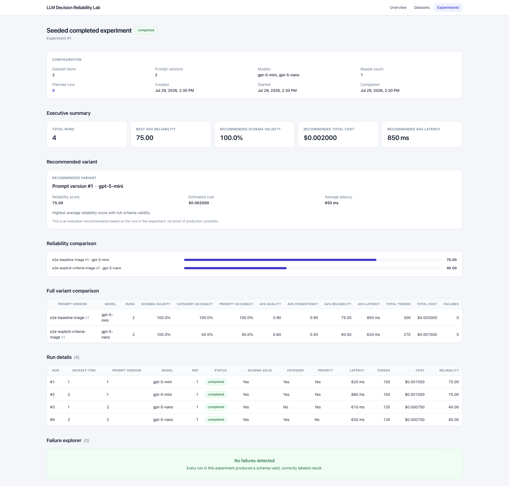
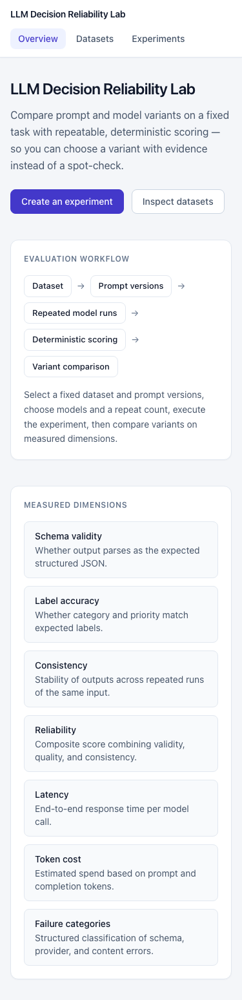
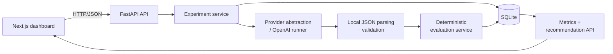

# LLM Decision Reliability Lab

A full-stack evaluation platform that compares prompt and model configurations on a fixed structured-output task using deterministic, repeatable scoring instead of manual spot-checks.

[](https://github.com/nolanefe/llm-decision-reliability-lab/actions/workflows/ci.yml)

## Overview

The lab runs a small, fixed evaluation dataset repeatedly against 2–3 prompt versions and one or more OpenAI models, scores every output deterministically, and rolls the results up into a single **reliability score** per prompt/model variant. A comparison dashboard shows which variant is most dependable, what it costs, and where it fails — so a variant can be chosen with evidence rather than a spot-check.

Reliability compares prompt/model configurations using deterministic evaluation only: outputs are checked by exact comparison against known-correct labels. There is no LLM judge, no semantic-similarity model, and no embeddings anywhere in the scoring pipeline. Cost and latency are measured and reported alongside reliability, but are intentionally excluded from the reliability score itself (see [Reliability scoring methodology](#reliability-scoring-methodology)).

## Problem addressed

Teams iterating on a prompt or model choice for a structured-output task have no lightweight way to answer "is this prompt/model combination actually reliable?" Manual spot-checks catch obvious failures but miss variance across repeated runs, silently invalid JSON output, and quality drift between prompt versions. This project runs a fixed task repeatedly across prompt/model variants and produces a single comparable score, without standing up a full evaluation platform.

## Core capabilities

- Fixed, version-controlled evaluation dataset of support-ticket triage tasks
- Multiple prompt versions compared side by side against the same dataset
- Repeated runs per (dataset item, prompt version, model) combination to measure consistency
- Structured JSON output requested from the model, parsed and validated locally — never trusted as-is
- Per-run schema-validity, latency, and token-cost tracking
- Deterministic quality and consistency scoring, rolled up into a single reliability score
- Automatic failure categorization (invalid JSON, schema error, provider error, timeout, content mismatch)
- A fixed, non-LLM recommendation cascade that selects one variant per completed experiment
- An experiment list and a detail/comparison view with a failure explorer

## Screenshots

All screenshots below were captured from a real production build (`next build` + `next start`) of the frontend. The experiment-results screenshot uses fixed, deterministic demo values (reliability scores of 75 and 40) injected via network-request mocking rather than a real OpenAI run, so the comparison view can be verified visually without live API calls; every other screenshot reflects the application's real seeded/default state.

| | |
|---|---|
|  **Overview** — landing page with the evaluation workflow and measured dimensions. |  **Create experiment** — dataset, prompt, model, and repeat-count selection with a live planned run count. |
|  **Execution confirmation** — required confirmation step before any paid API calls are made. |  **Experiment results** *(deterministic demo data)* — summary metrics, recommendation, and reliability comparison. |


**Responsive view** — the dashboard at a 375px mobile viewport.

## End-to-end workflow

```
1. Define a dataset item (support ticket + known expected category/priority) — fixed, checked into the repo
2. Define 2–3 prompt versions to compare
3. Create an experiment: select dataset items, prompt versions, models, and a repeat count
4. Execute the experiment (explicit, confirmed action — synchronous, one run at a time)
5. Each run: render prompt -> call model -> parse/validate JSON locally -> score deterministically
6. View results: per-variant metrics, a recommended variant, reliability comparison, and a failure explorer
```

## Reliability scoring methodology

Every dataset item has a known, fixed expected `category` and `priority`, so correctness can be checked by exact comparison rather than judgment. The reliability score is:

```
reliability_score = 100 * (
      0.60 * quality_component
    + 0.20 * consistency_component
    + 0.10 * schema_component
    + 0.10 * provider_component
)
```

The result is clamped to `[0.0, 100.0]` and rounded to two decimal places, computed with `Decimal` arithmetic throughout. Cost and latency are measured and reported per variant but are never inputs to this formula — they describe efficiency, not dependability, and folding them in would hide a real trade-off behind a single number.

Full metric definitions, the consistency formula, rounding/clamping behavior, and the recommendation tie-break cascade are documented in **[docs/reliability-scoring.md](./docs/reliability-scoring.md)**.

## Architecture



A Playwright test run never reaches this diagram's OpenAI runner: it always starts the backend with no API key configured, and any scenario needing a *completed* experiment's results intercepts those specific requests with fixed, deterministic JSON instead. See **[docs/architecture.md](./docs/architecture.md)** for component responsibilities, the full request/execution/evaluation flows, persistence and security boundaries, and the current synchronous-execution limitation.

## Technology stack

**Backend:** Python, FastAPI, SQLAlchemy 2.0, Alembic, Pydantic v2, pydantic-settings, the OpenAI Python SDK, pytest, httpx.

**Frontend:** Next.js 16 (App Router), React 19, TypeScript, Tailwind CSS 4, Playwright.

**Persistence:** SQLite (via SQLAlchemy, versioned with Alembic migrations).

**CI:** GitHub Actions — backend tests + migration check, frontend lint/build/audit + full Playwright E2E suite.

## Repository structure

```
backend/
  app/
    api/          FastAPI routers (dataset items, prompt versions, experiments, runs, health)
    core/          settings and shared exceptions
    db/            SQLAlchemy session/engine setup, seed data and seed script
    evaluation/     deterministic scoring, metrics, recommendation, failure sanitization
    experiments/    the executor: the sole orchestrator of experiment execution
    llm/            provider abstraction, the OpenAI runner, pricing, prompt rendering
    models/         SQLAlchemy ORM models
    schemas/        Pydantic request/response and structured-output schemas
    services/       CRUD/query logic backing the API routers
  alembic/          schema migrations
  scripts/          test-only fixture seeding for the Playwright suite
  tests/            pytest suite

frontend/
  app/              Next.js App Router routes (overview, datasets, experiments, new/detail)
  components/        shared UI components
  lib/               API client (api.ts) and hand-mirrored types (types.ts)
  e2e/               Playwright specs and fixtures

docs/
  architecture.md
  reliability-scoring.md
  screenshots/
```

## Local setup

Requires Python 3.13+, Node.js 22+, and an OpenAI API key (only needed to actually *execute* an experiment — every other feature works without one).

```bash
git clone https://github.com/nolanefe/llm-decision-reliability-lab.git
cd llm-decision-reliability-lab
```

## Environment variables

**`backend/.env`** (copy from `backend/.env.example`):

| Variable | Purpose |
|---|---|
| `APP_NAME` | Display name used in the FastAPI app title. |
| `ENVIRONMENT` | Free-text environment label (e.g. `development`). |
| `DATABASE_URL` | SQLAlchemy database URL, e.g. `sqlite:///./reliability_lab.db`. |
| `OPENAI_API_KEY` | OpenAI API key. Required only to execute experiments; every read-only feature works without it. |
| `MAX_RUNS_PER_EXPERIMENT` | Safety cap on planned run count (items × prompt versions × models × repeats) before execution is rejected. |
| `CORS_ALLOWED_ORIGINS` | Comma-separated list of origins allowed to call the API (no wildcards; credentials are never allowed). |

**`frontend/.env.local`** (copy from `frontend/.env.local.example`):

| Variable | Purpose |
|---|---|
| `NEXT_PUBLIC_API_BASE_URL` | Base URL of the FastAPI backend, e.g. `http://localhost:8000`. |

Never commit `.env` or `.env.local` — both are already git-ignored.

## Database setup and seed data

```bash
cd backend
python -m venv .venv && source .venv/bin/activate
pip install -r requirements-dev.txt

alembic upgrade head        # apply migrations
python -m app.db.seed       # load built-in dataset items + prompt versions (idempotent)
```

The seed command only inserts built-in records that don't already exist — matched by dataset item name, and by prompt version name + version — so it never overwrites existing rows and is safe to run repeatedly. It is **not** run automatically on application startup. The built-in dataset covers all five ticket categories (`billing`, `account_access`, `bug`, `feature_request`, `other`) and all four priorities (`low`, `medium`, `high`, `urgent`).

## Running the application

```bash
# Terminal 1 — backend
cd backend
source .venv/bin/activate
uvicorn app.main:app --reload --port 8000

# Terminal 2 — frontend
cd frontend
npm ci
npm run dev
```

Then open `http://localhost:3000`. This starts the frontend in development mode; screenshots in this README were instead captured from a production build (`npm run build && npm start`), which is also how the Playwright suite exercises the app.

## Running backend tests

```bash
cd backend
pytest
```

The suite runs entirely against a temporary SQLite database with a fake `LLMProvider` injected in place of the real OpenAI client — no backend test ever makes a live OpenAI request.

## Running frontend lint/build checks

```bash
cd frontend
npm run lint
npm run build
```

## Running Playwright E2E tests

```bash
cd frontend
npm run test:e2e
```

This spins up its own temporary backend/frontend process pairs (a real production build, never `next dev`) against isolated, freshly migrated SQLite databases, and always starts those backends with no `OPENAI_API_KEY` configured. Scenarios that need a *completed* experiment's results intercept the relevant requests with fixed, deterministic JSON via `page.route()` rather than exercising a real model call. No Playwright test ever reaches OpenAI.

## API overview

All endpoints are served under `/api/v1` (plus `GET /health`). No authentication is required or enforced.

| Method | Path | Purpose |
|---|---|---|
| `GET` | `/health` | Liveness check. |
| `GET`, `POST` | `/dataset-items` | List / create dataset items. |
| `GET` | `/dataset-items/{id}` | Fetch one dataset item. |
| `GET`, `POST` | `/prompt-versions` | List / create prompt versions. |
| `GET` | `/prompt-versions/{id}` | Fetch one prompt version. |
| `GET`, `POST` | `/experiments` | List / create experiments. |
| `GET` | `/experiments/{id}` | Fetch one experiment. |
| `POST` | `/experiments/{id}/execute` | Execute a draft experiment synchronously. |
| `GET` | `/experiments/{id}/runs` | List an experiment's runs. |
| `GET` | `/experiments/{id}/metrics` | Per-variant metrics and the recommendation. |
| `GET` | `/experiments/{id}/failures` | Sanitized failure entries for the failure explorer. |
| `GET` | `/runs/{id}` | Fetch one run. |

## Design decisions

- **Deterministic evaluation, not an LLM judge.** Correctness is checked by exact comparison against a known-correct label, so every score is reproducible from persisted data without re-running anything.
- **Synchronous, in-process execution.** There is no task queue or worker; execution runs one call at a time inside the triggering HTTP request. This keeps the system simple to run and reason about locally, at the cost of execution time scaling linearly with plan size (see [docs/architecture.md](./docs/architecture.md#current-synchronous-execution-limitation)).
- **Model output is never trusted.** The provider layer returns raw text unmodified; JSON parsing and schema validation happen locally, independent of whatever the model actually returned.
- **A single centralized scoring formula.** All quality/consistency/reliability math lives in one module (`app/evaluation/scoring.py`) so it can't drift between call sites.
- **A fixed, version-controlled dataset**, not an upload system — the dataset is part of the repository, not user data.
- **`Decimal` arithmetic** for every score and cost calculation, to avoid floating-point drift in figures that are compared and displayed.

## Security and privacy considerations

- No authentication or authorization — this is a single-user, local evaluation tool, not a multi-tenant service.
- CORS is explicit and credential-free: only the configured origins are allowed, only `GET`/`POST`, and `allow_credentials=False`.
- `OPENAI_API_KEY` is read once from backend environment configuration, never returned in any API response, and never visible to the frontend.
- Error messages persisted or surfaced to the failure explorer are sanitized: tracebacks are truncated, API-key-shaped tokens and absolute filesystem paths are redacted, and messages are length-capped.
- `MAX_RUNS_PER_EXPERIMENT` bounds both spend and blast radius before any provider call is made.
- The built-in dataset is entirely fictional support-ticket text with no personal information.

## Current limitations

- **Exact-match scoring only.** Quality scoring is exact comparison against expected `category`/`priority`; it cannot judge free-text fields or substantively-correct-but-differently-phrased output.
- **Single provider.** Only OpenAI models are supported (`gpt-5-mini`, `gpt-5-nano`).
- **Single fixed task.** The scoring formulas assume a task with a known correct label per item; they do not generalize to open-ended generation without a redesign.
- **Synchronous execution only.** No background jobs, retries, or resumable executions — see [Design decisions](#design-decisions).
- **No authentication, deployment configuration, or background processing.** This project runs locally; it is not configured or intended for production deployment.
- **Small samples.** Consistency and accuracy figures are only as meaningful as the `repeat_count` and dataset size used in a given experiment.

## Future improvements

- Additional model providers behind the existing `LLMProvider` abstraction
- Background/queued execution with progress polling, to remove the synchronous-request limitation
- A dataset-authoring UI, replacing the fixed, checked-in dataset
- Historical trend views across multiple experiments for the same prompt lineage

## License

[MIT](./LICENSE)
