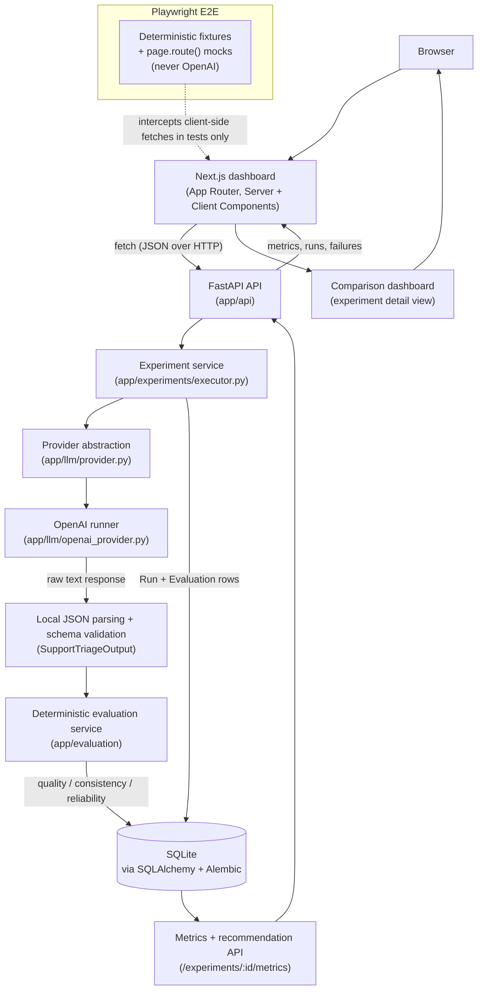

# Architecture

This document describes how the LLM Decision Reliability Lab is put
together: the responsibilities of each component, how a request and its
data move through the system, where persistence and security boundaries
sit, and how the current implementation is deliberately limited. It
describes v0.1 behavior only. See [reliability-scoring.md](./reliability-scoring.md)
for the scoring formulas themselves, and [../PROJECT_SPEC.md](../PROJECT_SPEC.md)
for the original product specification.

## System overview

The system is a single FastAPI backend and a single Next.js frontend
talking over a local HTTP API, backed by one SQLite database. There is no
queue, no background worker, no cache layer, and no authentication — an
experiment executes synchronously inside the HTTP request that triggers
it.



## Component responsibilities

- **Frontend (`frontend/`)** — a Next.js App Router application. Server
  Components fetch list/detail data at request time (`dynamic =
  "force-dynamic"`); the experiment detail view is a Client Component that
  fetches metrics/runs/failures after mount and drives the execute-confirm
  flow. `lib/api.ts` is the only module that calls the backend; `lib/types.ts`
  mirrors the backend's Pydantic schemas by hand (no shared codegen).
- **API layer (`backend/app/api`)** — thin FastAPI routers. Each endpoint
  validates its request with a Pydantic schema, delegates to a service or
  the executor, and returns a typed response model. No business logic
  lives here.
- **Experiment service / executor (`backend/app/experiments/executor.py`)**
  — the sole orchestrator of experiment execution. Validates the
  experiment is runnable, expands the (dataset item × prompt version ×
  model × repeat) Cartesian product into `Run` rows, calls the provider for
  each one sequentially, and hands completed output to evaluation.
- **Provider abstraction (`backend/app/llm/provider.py`)** — a `Protocol`
  (`LLMProvider.generate`) that the executor depends on. This is the only
  seam between orchestration and a concrete model API; tests inject a fake
  provider that satisfies the same protocol.
- **OpenAI runner (`backend/app/llm/openai_provider.py`)** — the only
  concrete `LLMProvider`. Calls the OpenAI Responses API in plain-text mode
  (no `response_format`), captures latency and token usage, and translates
  SDK exceptions into `ProviderError`/`ProviderTimeoutError`. It returns
  the model's raw text unmodified — it does not parse or validate it.
- **Local JSON parsing and validation** — inline in the executor
  (`_evaluate_output`). Each raw response is `json.loads`-ed and then
  validated against `SupportTriageOutput`, a Pydantic model with
  `extra="forbid"`. Both failure modes (`invalid_json`, `schema_error`) are
  distinguished failure categories, computed entirely locally with no
  network call.
- **Evaluation service (`backend/app/evaluation`)** — deterministic,
  network-free scoring:
  - `scoring.py` holds the single source of truth for quality,
    consistency, and reliability formulas.
  - `scorer.py` (`score_experiment`) loads every Run/Evaluation for an
    experiment, computes and persists scores in one transaction.
  - `metrics.py` (`compute_variant_metrics`) aggregates Runs/Evaluations
    into per-(prompt version, model) `VariantMetrics`.
  - `recommendation.py` (`build_recommendation`) selects one variant via a
    fixed tie-break cascade — never an LLM.
  - `failures.py` builds sanitized `FailureEntry` records for the failure
    explorer, redacting tracebacks, absolute paths, and API-key-shaped
    tokens from error messages.
- **Persistence (`backend/app/db`, `backend/app/models`, `backend/alembic`)**
  — SQLAlchemy models and Alembic migrations against SQLite. Foreign-key
  enforcement is explicitly enabled per connection (SQLite disables it by
  default). `app/db/seed.py` loads built-in dataset items and prompt
  versions idempotently; it is never run automatically on startup.

## Request and data flow

A typical read (e.g. loading the experiments list or a completed
experiment's metrics) is a straight round trip: Browser → Next.js Server
or Client Component → `fetch` to FastAPI → SQLAlchemy query → JSON
response → rendered UI. There is no intermediate cache; every request
re-reads SQLite.

## Experiment execution flow

Execution is triggered by `POST /api/v1/experiments/{id}/execute` and runs
entirely inside that request:

1. **Validate.** The experiment must be `draft`, have no existing Runs, and
   reference known dataset items, prompt versions, and supported models.
   The planned run count (`items × prompt versions × models × repeat
   count`) must not exceed `MAX_RUNS_PER_EXPERIMENT`.
2. **Mark running.** The experiment's status flips to `running` and
   `started_at` is set, committed immediately so the state is visible even
   if execution is later interrupted.
3. **Expand and persist planned Runs.** Every `(dataset item, prompt
   version, model, repetition)` combination becomes a `Run` row up front.
4. **Execute sequentially.** For each Run: render the prompt template
   against the dataset item's `input_text`, call the provider, and record
   status, latency, token counts, and estimated cost (via a fixed local
   pricing table, `Decimal` arithmetic throughout). A single Run's provider
   failure never aborts the remaining Runs.
5. **Evaluate each output.** Parse and validate the raw response locally
   (see above), then persist an `Evaluation` recording schema validity and
   label correctness against the dataset item's expected `category`/
   `priority`.
6. **Score.** Once every Run is terminal, `score_experiment` computes
   quality, consistency, and reliability scores for every Evaluation in
   one transaction.
7. **Mark completed.** The experiment's status flips to `completed` with
   `completed_at` set, and the response summarizes planned/completed/failed
   run counts and the resulting recommendation.

Any unexpected exception during steps 2–7 rolls the transaction back,
marks the experiment `failed`, and surfaces a generic 500 — see **Failure
handling** below.

## Evaluation flow

Evaluation is a pure function of already-persisted Run data — it never
calls a model or makes a network request:

```
Run.raw_response
  -> json.loads                         (invalid -> failure_category=invalid_json)
  -> SupportTriageOutput.model_validate  (invalid -> failure_category=schema_error)
  -> compare category/priority to DatasetItem's expected values
  -> Evaluation{schema_valid, category_correct, priority_correct}
       -> compute_quality_score           (per run)
       -> compute_group_consistency_score (per dataset_item/prompt_version/model group)
       -> compute_reliability_score       (per run, from quality + consistency + schema + provider status)
```

Because correctness is checked by exact comparison against a known label,
every score is reproducible from persisted data without re-running
anything — there is no LLM judge, semantic-similarity model, or embedding
anywhere in this pipeline. Full formulas and rationale live in
[reliability-scoring.md](./reliability-scoring.md).

## Persistence boundaries

- SQLite is the only datastore; there is no cache, queue, or external
  service dependency. `DATABASE_URL` fully determines where state lives.
- Schema changes go through Alembic migrations only; `alembic upgrade
  head` against an empty database must reproduce the current schema
  exactly (verified by both CI and `tests/test_migrations.py`).
- SQLite foreign-key enforcement is turned on explicitly per connection
  (`PRAGMA foreign_keys=ON`), since SQLite otherwise silently ignores
  `ON DELETE` behavior.
- The built-in dataset items and prompt versions (`app/db/seed_data.py`,
  loaded via `python -m app.db.seed`) are inserted idempotently, matched
  by name (dataset items) or name+version (prompt versions) — the seed
  command never overwrites an existing row and is never invoked
  automatically by the application.
- A separate, test-only seed script (`backend/scripts/e2e_seed.py`) loads
  fictional fixture data into an isolated database for Playwright; it is
  never imported by the application and is wired only into
  `playwright.config.ts`.

## Failure handling

Failure is handled at two distinct levels, deliberately kept separate:

- **Per-run outcomes** (a provider timeout, a provider error, invalid
  JSON, a schema mismatch, or a correct-schema-but-wrong-label response)
  are *measured experiment results*, not orchestration errors. Each one is
  recorded as a specific `FailureCategory` on that Run's `Evaluation` and
  folds into that variant's scores; execution continues to the next Run.
- **Orchestration failures** (an unhandled exception, a database error
  mid-execution, or incomplete Run/Evaluation data reaching the scorer)
  mark the whole Experiment `failed` and surface as a generic 500 via
  FastAPI exception handlers (`app/api/error_handlers.py`). Domain errors
  (`NotFoundError`, `ConflictError`, `UnprocessableEntityError`,
  `ProviderUnavailableError`) map to specific 404/409/422/503 responses so
  the frontend can show an actionable message instead of a generic
  failure.
- Error messages ever persisted or returned (`Run.error_message`,
  `FailureEntry.sanitized_error_message`) are sanitized before storage:
  tracebacks are truncated at their marker, API-key-shaped tokens and
  absolute filesystem paths are redacted, and the result is length-capped.

## Testing boundaries

- **Backend tests** (`backend/tests`, pytest) exercise the FastAPI app,
  services, and evaluation logic directly against a real (temporary)
  SQLite database. The executor's `get_llm_provider` FastAPI dependency is
  overridden with a fake provider (`tests/fakes.py`) in every test that
  triggers execution, so **no backend test ever calls OpenAI**.
- **Frontend Playwright E2E tests** (`frontend/e2e`) run against a real
  production build (`next build` + `next start` — never `next dev`, whose
  hot-reload websocket handshake cannot complete in this environment) and
  a real backend process. That backend is always started with
  `OPENAI_API_KEY=""`, and scenarios that need a *completed* experiment's
  results intercept the relevant `fetch` calls with `page.route()` and
  return fixed JSON (see `frontend/e2e/fixtures/completed-experiment.ts`)
  rather than exercising real execution — so **no Playwright test ever
  calls OpenAI either**. This is also how the deterministic 75/40
  reliability scores used in this repository's screenshots were produced.
- CI runs both suites on every push/PR to `main` (`.github/workflows/ci.yml`):
  backend job runs `alembic upgrade head` + `alembic check` + `pytest`;
  frontend job runs lint, build, `npm audit --omit=dev`, and the full
  Playwright suite against its own throwaway backend.

## Security boundaries

- **No authentication or authorization.** Every endpoint is open; this is
  an evaluation tool for local/individual use, not a multi-tenant service.
- **CORS is explicit and credential-free.** `CORSMiddleware` allows only
  the origins listed in `CORS_ALLOWED_ORIGINS` (no wildcard), only
  `GET`/`POST`, and `allow_credentials=False`.
- **Secrets stay server-side.** `OPENAI_API_KEY` is read once from backend
  environment configuration and never returned in any API response; the
  frontend never sees it. Error messages are sanitized (see **Failure
  handling**) specifically to keep key-shaped tokens out of anything
  persisted or displayed.
- **A hard cap bounds spend and blast radius.** `MAX_RUNS_PER_EXPERIMENT`
  rejects oversized execution plans before any provider call is made.
- **Input validation happens at the API boundary.** Every write goes
  through a Pydantic schema (`extra="forbid"` where applicable); model
  output is treated as untrusted and independently re-validated locally
  before it can affect a score.

## Current synchronous execution limitation

Execution runs Runs **one at a time, in-process, inside the HTTP request**
that triggered it (`app/experiments/executor.py`). There is no task queue,
no worker process, and no background job — the request that calls
`/execute` blocks until every planned Run has completed or failed. This is
an intentional v0.1 scope boundary (see "Explicitly Excluded" in
[PROJECT_SPEC.md](../PROJECT_SPEC.md)): it keeps the system trivially easy
to reason about and run locally, at the cost of two real limits:

- **Wall-clock time scales linearly with plan size.** A large `(dataset
  items × prompt versions × models × repeat count)` plan takes
  proportionally longer, and the frontend's execute button stays in a
  blocking "Executing…" state for the whole request — `MAX_RUNS_PER_EXPERIMENT`
  exists largely to keep this bounded.
- **No retry, pause, or resume.** If the request is interrupted (e.g. the
  client disconnects or the process is killed) mid-execution, the
  experiment is left in whatever state its last committed transaction
  reached, and there is no mechanism to resume it from that point —
  re-execution of an experiment that already has Runs is rejected
  (`ConflictError`) rather than retried.

Moving to queued/background execution would be a real design change (a
worker process, a job status model, and a way to reconcile client polling
with server-side progress) and is out of scope for this repository.
